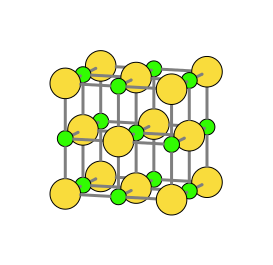

# structurePlotter

Based on [Peter Müller's original structurePlotter](https://github.com/p-c-mueller/structurePlotter).
Extended with depth-correct bond rendering, SVG output, and various command-line options.

A small command-line tool that converts a `.vesta` crystal structure file into a
depth-correct 2D-projected vector graphic (SVG by default, PDF optional).

## Gallery



## Features

- Painter's algorithm with geometric self-occlusion correction: bonds are clipped
  against their own endpoint atoms in true 3D, so they correctly stop at atom surfaces
- Three bond rendering modes (center-to-center, screen-clipped, perspective-correct)
- SVG output with atoms as single fill+stroke objects and bonds grouped for easy
  recoloring in Illustrator or Inkscape — no clipping masks, no split objects
- Optional PDF output via Cairo

## Dependencies

- [Eigen](https://eigen.tuxfamily.org/) — linear algebra
- [Boost](https://www.boost.org/) — shared pointer utilities
- [Cairo](https://www.cairographics.org/) — only needed for `--pdf` output; SVG
  output (the default) works without Cairo at runtime, but Cairo is still required
  at build time

## Building on macOS

Without Homebrew/MacPorts, the easiest route is via a conda environment:

```sh
conda create -n structureplotter -c conda-forge cmake eigen boost cairo pkg-config zlib freetype cxx-compiler
conda activate structureplotter
cmake -S . -B build
cmake --build build
```

With Homebrew:

```sh
brew install cmake eigen boost cairo pkg-config
cmake -S . -B build
cmake --build build
```

The resulting binary is `build/structurePlotter`.

## Usage

```sh
structurePlotter [options] structure.vesta [structure2.vesta ...]
```

Output is written alongside each input file by default. Multiple files can be
processed in one invocation.

### Options

| Flag | Description |
|------|-------------|
| `--bond-mode <0\|1\|2>` | Bond rendering mode (default: `0`) |
| `--no-cell-edges` | Skip the unit cell wireframe box |
| `--bond-color <name\|R,G,B>` | Override all bond colors (wireframe unaffected) |
| `--bond-width <factor>` | Multiply all bond widths by this factor (default: `1.5`; wireframe unaffected) |
| `--atom-outline <factor>` | Atom outline stroke as a multiple of `scale/20` (default: `1.0`; use `0` to suppress) |
| `--output <directory>` | Write output to a specific directory |
| `--scale <number>` | Scale factor in pts/Å (default: `20`; try `40`–`50` for larger figures) |
| `--svg` | Output SVG — **default** |
| `--pdf` | Output PDF via Cairo instead of SVG |
| `--help` / `-h` | Print this option list |

### Bond modes

- `0` — bonds drawn between atom centers
- `1` — bonds clipped to the projected (2D) atom circle
- `2` — bonds clipped to the true 3D atom sphere; perspective-correct cylinder end
  caps (closest to VESTA's rendering)

### Color names for `--bond-color`

`black`, `white`, `red`, `green`, `blue`, `gray` — or an explicit `R,G,B` triplet
with each component in 0–255, e.g. `--bond-color 255,128,0`.

### Examples

```sh
# Default: SVG alongside the input file, mode 0, with cell edges
structurePlotter structure.vesta

# Perspective-correct bonds, no cell box, larger scale, output in current directory
structurePlotter --bond-mode 2 --no-cell-edges --scale 40 --output . structure.vesta

# Black bonds, larger scale, PDF output
structurePlotter --bond-color black --scale 40 --pdf structure.vesta

# Batch: multiple structures at once
structurePlotter --bond-mode 2 structure1.vesta structure2.vesta structure3.vesta
```

The `examples/` directory contains the `.vesta` source files for the gallery above.

## Illustrator / CorelDraw / Inkscape workflow

Open the SVG with **File → Open** (not Place). Each atom is a single object with
both fill and stroke. Each bond is a `<g>` group — select it and recolor in one step.

- **Modes 0 and 1**: bond segments are stroked lines (`stroke` attribute). Select the
  group and change the stroke color to recolor the whole bond.
- **Mode 2**: bond segments are filled rectangles and end caps are filled ellipses
  (all `fill` attribute), so fill and caps can be recolored together in one step.
